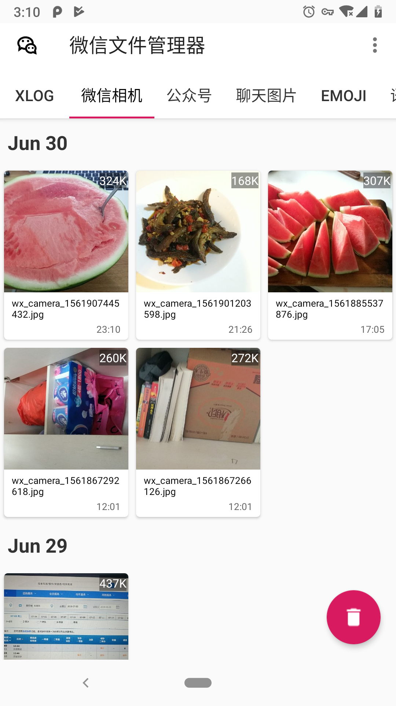
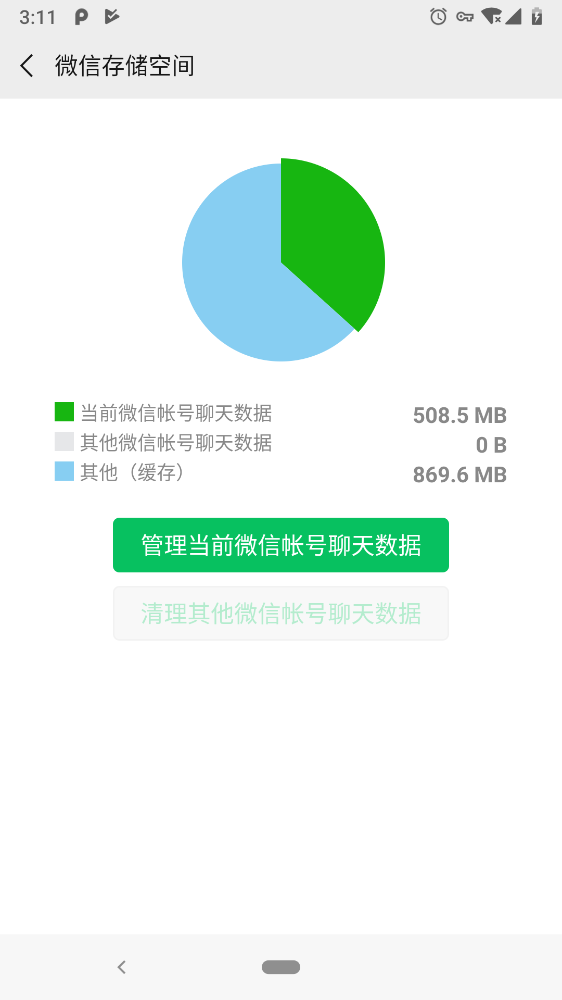
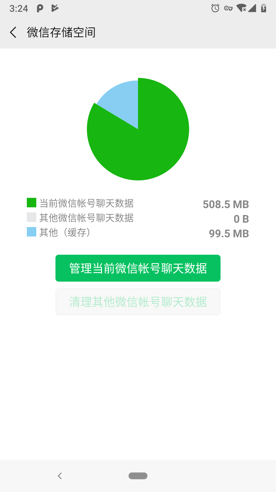

## 微信文件管理器


这是我练习[Jectpack](https://developer.android.com/jetpack)写的一个应用，用来管理微信缓存在手机本地的文件；
虽然微信有自带的清理功能，但里面的其他文件是清理不了的。这不是在逗我吗？  
而这些其他文件就是手机SD卡/Tencent/MicroMsg目录下的文件；你通过微信查看过的图片、视频、语音、表情等等...都存储在这个目录下  
用Android自带的文件管理器打开这个目录，发现有大多数子目录加了[.nomedia](https://zmywly8866.github.io/2016/05/05/android-disable-mediascanner-folders.html)，很多文件也没有后缀；所以我们根本
不知道如何打开它；也不知道它有没有用。 

#### 功能

* 对文件进行分类整理，对没有后缀的文件用代码识别它的真正类型； 以时间倒序排列展示。提供查看，删除，分享等功能  
* 单击打开文件，长按进行删除和分享等操作。对特殊的文件做了处理，比如微信接收的.apk安装包，微信会篡改它的后缀名无法直接点击安装  
使用本此应用可直接点击安装

* 一键清理（只保留微信相机和微信接收的文件）其他的均会删除

### release
v1.0.0
[下载apk](https://www.pgyer.com/gRvc)


| app界面  | 清理前 | 清理后 |
| --------| ------ | ----- |
|  |  | |


## 微信缓存文件目录


```
MicroMsg
│
├── CDNTemp //这个基本没啥文件
│
├── Cache //就是这个意思
│
├── CheckResUpdate //这个也没啥文件
│
├── Download  //通过微信接收的文件都保存在这里
│
├── FailMsgFileCache
│  
├── Game  
│  
├── Handler
│   
├── SQLTrace
│   
├── WeChat
│
├── WebNetFile   
│   
├── WebviewCache
│  
├── WeiXin //使用微信拍照，通过微信保存的图片和视频保存在这里
│
├── browser
│  
├── card
│  
├── crash //奔溃日志
│
├── da93d8b94d8056da1d9c3ede1fb12afc //用户
│   ├── attachment 
│   ├── avatar
│   ├── backupRecover
│   ├── bizimg
│   ├── bizmsg //
│   ├── boots
│   ├── brandicon
│   ├── draft
│   ├── emoji //表情包文件，目前只能识别封面；表情文件被加密无法打开
│   ├── favorite //收藏的文件
│   ├── image //公众号产生的图片
│   ├── image2 //聊天的图片都在这里
│   ├── locallog
│   ├── logcat
│   ├── mailapp
│   ├── msgsynchronize
│   ├── oneday
│   ├── openapi //第三方库产生的图片
│   ├── openim
│   ├── package
│   ├── record
│   ├── sfs 
│   ├── sns //刷朋友圈看过的图片和视频都保存在这里
│   ├── story
│   ├── video // 聊天产生的视频和缩略图
│   ├── voice2// 语音文件
│   └── wenote
├── diskcache
├── fts
│   └── FTS5IndexMicroMsgInfo.txt
├── newyear
├── recovery
│   └── version.info
├── sns_ad_landingpages
├── vproxy
├── vusericon
├── wallet 
│   ├── images
│   └── mall
├── wepkg
│   └── pkgfiles
├── wxacache
├── wxafiles
├── wxanewfiles
└── xlog

```

## 使用到的一些库

* [Lifecycles](https://developer.android.com/topic/libraries/architecture/lifecycle)
* [LiveData](https://developer.android.com/topic/libraries/architecture/livedata)
* [Room](https://developer.android.com/topic/libraries/architecture/room)
* [Glide](https://github.com/bumptech/glide)
* [Android-Debug-Database](https://github.com/amitshekhariitbhu/Android-Debug-Database)

